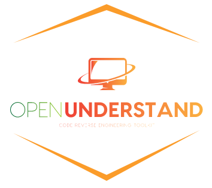

# OpenUnderstand



An open-source implementation of the [SciTools Understand](https://scitools.com)
Python API, for Java.

Understand reads a codebase and lets you ask questions about it — which methods
call this one, what does this class contain, how complex is this function. The
API is good. The analysis is closed: the database format is proprietary, the API
source is not published, and it needs a licence.

OpenUnderstand reimplements that API on top of an ANTLR4 Java parser and a
SQLite database, so the same scripts run without one.

```python
import openunderstand.ounderstand as und

db = und.open("myproject.udb")

for cls in db.ents("Class"):
    print(cls.longname())
    for ref in cls.refs("Define", "Method"):
        print("   ", ref.ent().name(), "at line", ref.line())
```

That is Understand's API, unchanged. Same class names, same method signatures,
same kind names.

## Install

```bash
pip install openunderstand
```

Python 3.9+. Optional extras:

| Extra | For |
| --- | --- |
| `openunderstand[speedy]` | the C++ parser accelerator (~8× faster parsing) |
| `openunderstand[mcp]` | the MCP server, so an assistant can query your code |

From a checkout instead:

```bash
git clone https://github.com/m-zakeri/OpenUnderstand
cd OpenUnderstand
python -m venv .venv && . .venv/bin/activate
pip install -e ".[dev]"
```

## Build a database

Point it at a directory of Java source:

```bash
python openunderstand/ounderstand/openunderstand.py \
    -r /path/to/java/project \
    -dba /path/for/database \
    -dbn myproject.udb \
    -l /path/for/app.log
```

| Flag | Meaning |
| --- | --- |
| `-r` | source directory to analyse |
| `-dba` | directory to write the database into |
| `-dbn` | database filename |
| `-e` | `C++` (fast) or `Python` parser backend |
| `-l` | log file |

Or from Python:

```python
from openunderstand.ounderstand.openunderstand import start_parsing

start_parsing(
    repo_address="/path/to/java/project",
    db_address="/path/for/database",
    db_name="myproject.udb",
    engine_core="C++",
    log_address="/path/for/app.log",
)
```

The result is a `.udb` file. Despite the name it is plain SQLite — open it with
any SQLite tool if you want to poke at the rows directly.

## How correct is it?

Honestly measured, not claimed. `scripts/compare/` builds a database with
OpenUnderstand and one with real Understand from the same source, then diffs
them.

On the `org.json` benchmark (22 files), current agreement:

| | |
| --- | ---: |
| Entities Understand finds that OpenUnderstand also finds | 1030 / 1236 |
| References reproduced at the exact same position | 47% |
| Reference precision | 0.36 |

[docs/parity.md](docs/parity.md) has the per-kind breakdown, and
`scripts/compare/out/<fixture>/report.md` ranks every remaining defect.

If you have Understand installed and licensed, run it yourself:

```bash
bash scripts/fetch_benchmarks.sh JSON
bash scripts/compare/run_all.sh --fixture JSON
```

This is the test suite. There are no unit tests, because the only
specification that matters is what the real tool outputs.

## Use it from an assistant

An MCP server ships with the package:

```bash
pip install "openunderstand[mcp]"
```

```json
{"mcpServers": {"openunderstand": {"command": "openunderstand-mcp"}}}
```

Six tools (`analyze`, `open_database`, `list_entities`, `entity_references`,
`entity_metrics`, `list_kinds`), four resources exposing the kind vocabulary
and metric names, and three prompts (`review_class`, `complexity_hotspots`,
`trace_callers`) — so an assistant can analyse a Java project and ask what
calls what, without knowing the schema. See [docs/mcp.md](docs/mcp.md).

## What it does not do

- **Java 8 only.** The grammar predates records, sealed types, `var`, text
  blocks and `yield`.
- **No external resolution.** The JDK and third-party jars are not analysed, so
  `java.lang.String` exists but has no members.
- **Partial coverage.** Roughly half of Understand's references are reproduced.
  Unimplemented API methods raise `NotImplementedError` rather than returning
  something plausible and wrong.

## Documentation

| | |
| --- | --- |
| [Getting started](docs/index.md) | install, build, query |
| [API reference](docs/api.md) | every class and method, and what is missing |
| [Kinds](docs/kinds.md) | the 237 entity and 106 reference kinds |
| [Architecture](docs/architecture.md) | how a file becomes rows; how to add a pass |
| [Parity](docs/parity.md) | measured agreement with Understand |
| [MCP server](docs/mcp.md) | query your code from an assistant |

Published at
[m-zakeri.github.io/OpenUnderstand](https://m-zakeri.github.io/OpenUnderstand/).

## Contributing

Read [docs/architecture.md](docs/architecture.md) first — particularly the rule
that kind ids are positions and must always be resolved by name.

Then: make the change, run
`bash scripts/compare/run_all.sh --fixture calculator_app`, and report recall
*and* precision before and after. A change that raises recall by tanking
precision is not an improvement.

Pull requests target the `dev` branch.

## Credits

Started at the IUST Reverse Engineering Research Laboratory. Uses
[ANTLR4](https://www.antlr.org/), [peewee](http://docs.peewee-orm.com/), and a
labelled fork of the [grammars-v4](https://github.com/antlr/grammars-v4) Java
grammar.
