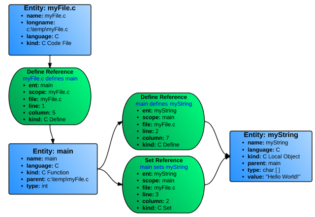
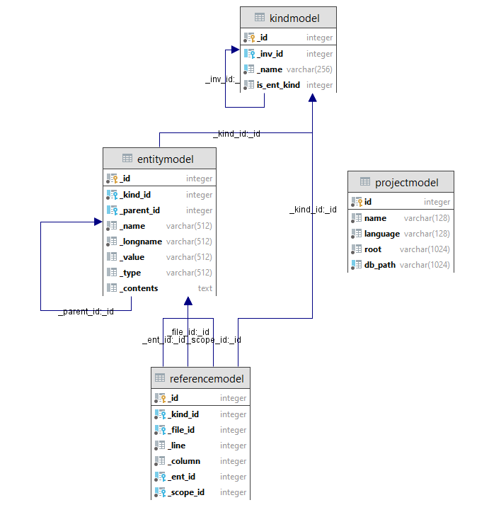

# Welcome to OpenUnderstand

An open-source implementation of Understand Python API.
Visit 
[source code](https://github.com/m-zakeri/OpenUnderstand).

## Introduction
Understand [1] has an extensive API to let developers query the data it captures about their code. It has three flavors: Perl, Python, and C. We work with Python API.  All three implementations of the Understand APIs are read-only. They do not modify the Understand project information. If there is a need to modify Understand project information programmatically, the 'und' tool must be used. Unfortunately, the Understand API source code is not publicly available, making it difficult to change, customize, and reuse in new activities and environments which appears in academic researches. 

This project aims to provide an open-source implementation of the Understand Python API to analyze the source codes. We primarily focus on implementing the API for Java programs using Python programming languages and compiler tools such as ANTLR [2]. To develop an open-source implementation of Understand Python API, we look at the structures used by Understand for analyzing source codes.


## Project layout

### Entity and reference
Most of the data captured by Understand involves Entities and References.

- **Entity:** An Entity is anything in the code that Understand captures information on: i.e., A file, a class, a variable, a function, etc. In the Perl API, Entities are represented with the Understand::Ent class. In Python, it is the Understand.Ent class.
- **Reference:** A specific place where an entity appears in the code. A reference is always defined as a relationship between two entities. e.g., function Bar is called on line 14 of function Foo. In the Perl API, References are represented with the Understand::Ref class. In Python, it is the Understand.Ref class.


Every entity and reference have a unique set of attributes that can be queried by the API. A few of the attributes you can view for an entity would be its name, its type, any associated comments, what kind of entity it is, and if it has them: its parent entity and its parameters. On the other hand, a reference would have both of the entities associated with it as well as the file, line, and column where the reference occurs and what kind of reference it is. To help visualize this, let's use this simple C code:

```c
myFile.c

    void main(){
       char myString[];
       myString = “Hello World!”;
}
```

Understand would identify three entities (blue) and three references (green), shown in Figure 1.



_Figure 1. Understand data structure for a simple C code_

Since all references are relationships between two objects, the references are actually stored going in both directions. Hence, each reference kind has an opposite: "Define" and "DefineIn", "Set" and "SetBy", "Call" and "Callby", etc. The same entities of Figure 1 with their reverse references are shown in Figure 2.


_Figure 2. References of Figure 1 in inverse directions_


### Entity kinds
A comprehensive list of OpenUnderstand entity kinds for Java programming language can be found on
[Entity kind page](entity_kinds.md)

### Reference kind
A comprehensive list of OpenUnderstand reference kinds for Java programming language can be found on
[Reference kind page](reference_kinds.md)


## Architecture
This section briefly describes the OpneUndertsand architecture.

### Database schema ERD
For the database section of this project, `peewee` library and `SQLite3` are used.
It is essential to read the [peewee's documents](http://docs.peewee-orm.com/en/latest/) as well.

The entity-relationship diagram (ERD) for the designed database for OpneUnderstand symbol table is shown in Figure 3. There are four important tables in OpenUnderstand database, created for each project during static analysis:

* **Project:** For storing some basic information about the project under analysis such as project name, programming languages, etc. This table fills automatically.
* **Kind:** For storing both the entity and reference kinds which are separable by `is_ent_kind` boolean.
    This table fills automatically.
* **Entity:** For storing Java entities in the project. This table fills during the program static analysis by [ANTLR listeners](tutorials.md).
* **Reference:** For storing Java references in the project. This table fills during the program static analysis by [ANTLR listeners](tutorials.md).



_Figure 3. OpenUnderstand database schema ERD_


### Some architectural notes
* Multiple analysis passes are required to capture all entities and references kinds
  * OpenUnderstand analysis project files in at least two passes.
* File is the root since the parent of files is None.
* Parent of a package is its first file according to alphabetical sort of all files in the package.
* Parent of other entities is their definition place.
* Only variables have value.
* Classes that are not in project are Unknown.


## API
There is a designed and read-to-use API in `db/api.py` for querying the database and checking the results with Understand.
The API is exactly the same as Understand's API to be compatible with Understand tool.

### Initializing the database

```python
from openunderstand.oudb.api import create_db
from openunderstand.oudb.fill import main

create_db(
    dbname="G:\Dev\OpenUnderstand\database.oudb",  # customize the path
    project_dir="G:\Dev\OpenUnderstand\benchmark\calculator_app"  # customize the path
)
main()
```

### Filling OpenUnderstand tables
It is essential to check whether a reference or entity kinds have already been inserted into the database or not, before any insert operation. Any duplicated entity or reference should be avoided.
To this aim, we provide the following `get` and `create` methods.

*Get* or *create* an instance:

```python
obj, has_created = ModelName.get_or_create(**fields)
```


*Get* or *none*:

```python
obj = ModelName.get_or_none(**fields)
```

To find more information about CRUD operations check out the [peewee's documents](http://docs.peewee-orm.com/en/latest/).


### Using the API

```python
from openunderstand.oudb.api import open as db_open

db = db_open("G:\Dev\OpenUnderstand\database.oudb")  # customize the path
ent = db.lookup("Admin", "method")[0]

print(ent, ent.kind())
print(ent, ent.simplename())
for ref in ent.refs(entkindstring="method"):
    print(ref)
# The results should be exactly similar to Understand.
```

### API tests
To facilitate the verification process OpenUnderstand uses a set of unit tests for each entity and reference kinds. The unit test mainly used the [benchmark projects](benchmarks.md).
Tests oracles are generated by Understand v6.0 automatically. 


## Current development proposal
Our current development proposal is Core entity-reference development which is available on [development proposals section](https://m-zakeri.github.io/OpenUnderstand/proposals/core_entity_reference_development/).


## FAQs
If you have any further questions, or you are interested to be a core developer do not hesitate to contact us. You can send an e-mail to m-zakeri@live.com with the subject "OpenUnderstand".


## References

[1]	SciTools, “Understand,” 2020. https://www.scitools.com/ (accessed Sep. 11, 2020).

[2]	T. Parr and K. Fisher, “LL(*): the foundation of the ANTLR parser generator,” Proc. 32nd ACM SIGPLAN Conf. Program. Lang. Des. Implement., pp. 425–436, 2011, doi: http://doi.acm.org/10.1145/1993498.1993548.

