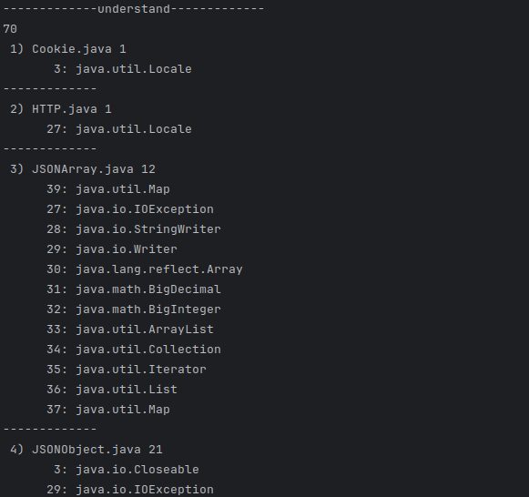
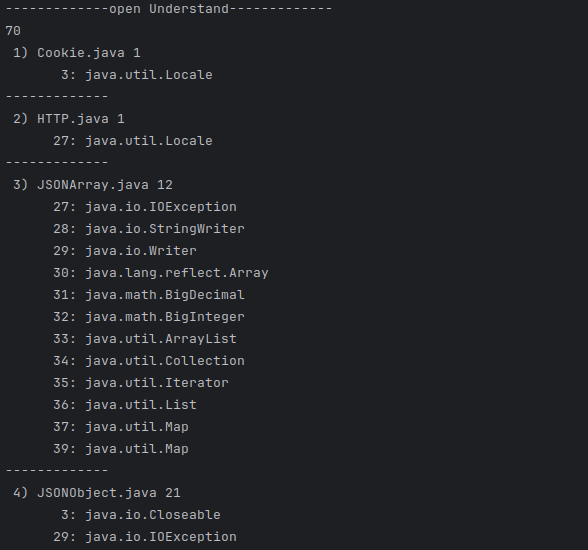
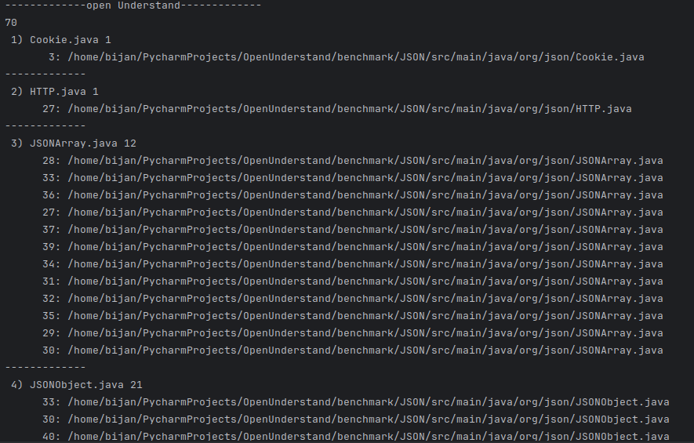

# Import ImportBy

## Understand VS OpenUnderstand (JSON project)

### at first step we show count of entity and after that we show this pattern :
file_number) file name count_of_entity
line_number: refrence_longname
------------------------------------------

- Import output in Understand


- Import output in OpenUnderstand


```
70
 1) Cookie.java 1
	   3: java.util.Locale
-------------
 2) HTTP.java 1
	  27: java.util.Locale
-------------
 3) JSONArray.java 12
	  39: java.util.Map
	  27: java.io.IOException
	  28: java.io.StringWriter
	  29: java.io.Writer
	  30: java.lang.reflect.Array
	  31: java.math.BigDecimal
	  32: java.math.BigInteger
	  33: java.util.ArrayList
	  34: java.util.Collection
	  35: java.util.Iterator
	  36: java.util.List
	  37: java.util.Map
-------------
 4) JSONObject.java 21
	   3: java.io.Closeable
	  29: java.io.IOException
	  30: java.io.StringWriter
	  31: java.io.Writer
	  32: java.lang.annotation.Annotation
	  33: java.lang.reflect.Field
	  34: java.lang.reflect.InvocationTargetException
	  35: java.lang.reflect.Method
	  36: java.lang.reflect.Modifier
	  37: java.math.BigDecimal
	  38: java.math.BigInteger
	  39: java.util.Collection
	  40: java.util.Enumeration
	  41: java.util.HashMap
	  42: java.util.Iterator
	  43: java.util.Locale
	  44: java.util.Map
	  45: java.util.Map.Entry
	  46: java.util.ResourceBundle
	  47: java.util.Set
	  48: java.util.regex.Pattern
-------------
 5) JSONPointer.java 6
	   5: java.io.UnsupportedEncodingException
	   6: java.net.URLDecoder
	   7: java.net.URLEncoder
	   8: java.util.ArrayList
	   9: java.util.Collections
	  10: java.util.List
-------------
 6) JSONPropertyIgnore.java 4
	  30: java.lang.annotation.Documented
	  31: java.lang.reflect.Field
	  32: java.lang.annotation.Retention
	  33: java.lang.annotation.Target
-------------
 7) JSONPropertyName.java 3
	  30: java.lang.annotation.Documented
	  31: java.lang.annotation.Retention
	  32: java.lang.annotation.Target
-------------
 8) JSONStringer.java 1
	  27: java.io.StringWriter
-------------
 9) JSONTokener.java 6
	   3: java.io.BufferedReader
	   4: java.io.IOException
	   5: java.io.InputStream
	   6: java.io.InputStreamReader
	   7: java.io.Reader
	   8: java.io.StringReader
-------------
10) JSONWriter.java 3
	   3: java.io.IOException
	   4: java.util.Collection
	   5: java.util.Map
-------------
11) Property.java 2
	  27: java.util.Enumeration
	  28: java.util.Properties
-------------
12) XML.java 6
	  27: java.io.Reader
	  28: java.io.StringReader
	  29: java.lang.reflect.Method
	  30: java.math.BigDecimal
	  31: java.math.BigInteger
	  32: java.util.Iterator
-------------
13) XMLParserConfiguration.java 3
	  26: java.util.Collections
	  27: java.util.HashMap
	  28: java.util.Map
-------------
14) XMLTokener.java 1
	  27: java.io.Reader
-------------

```

- ImportBy output in Understand


- ImportBy output in OpenUnderstand


```
70
 1) Cookie.java 1
	   3: /home/bijan/PycharmProjects/OpenUnderstand/benchmark/JSON/src/main/java/org/json/Cookie.java
-------------
 2) HTTP.java 1
	  27: /home/bijan/PycharmProjects/OpenUnderstand/benchmark/JSON/src/main/java/org/json/HTTP.java
-------------
 3) JSONArray.java 12
	  30: /home/bijan/PycharmProjects/OpenUnderstand/benchmark/JSON/src/main/java/org/json/JSONArray.java
	  33: /home/bijan/PycharmProjects/OpenUnderstand/benchmark/JSON/src/main/java/org/json/JSONArray.java
	  31: /home/bijan/PycharmProjects/OpenUnderstand/benchmark/JSON/src/main/java/org/json/JSONArray.java
	  32: /home/bijan/PycharmProjects/OpenUnderstand/benchmark/JSON/src/main/java/org/json/JSONArray.java
	  34: /home/bijan/PycharmProjects/OpenUnderstand/benchmark/JSON/src/main/java/org/json/JSONArray.java
	  27: /home/bijan/PycharmProjects/OpenUnderstand/benchmark/JSON/src/main/java/org/json/JSONArray.java
	  35: /home/bijan/PycharmProjects/OpenUnderstand/benchmark/JSON/src/main/java/org/json/JSONArray.java
	  36: /home/bijan/PycharmProjects/OpenUnderstand/benchmark/JSON/src/main/java/org/json/JSONArray.java
	  37: /home/bijan/PycharmProjects/OpenUnderstand/benchmark/JSON/src/main/java/org/json/JSONArray.java
	  28: /home/bijan/PycharmProjects/OpenUnderstand/benchmark/JSON/src/main/java/org/json/JSONArray.java
	  29: /home/bijan/PycharmProjects/OpenUnderstand/benchmark/JSON/src/main/java/org/json/JSONArray.java
	  39: /home/bijan/PycharmProjects/OpenUnderstand/benchmark/JSON/src/main/java/org/json/JSONArray.java
-------------
 4) JSONObject.java 21
	  43: /home/bijan/PycharmProjects/OpenUnderstand/benchmark/JSON/src/main/java/org/json/JSONObject.java
	  37: /home/bijan/PycharmProjects/OpenUnderstand/benchmark/JSON/src/main/java/org/json/JSONObject.java
	  38: /home/bijan/PycharmProjects/OpenUnderstand/benchmark/JSON/src/main/java/org/json/JSONObject.java
	  39: /home/bijan/PycharmProjects/OpenUnderstand/benchmark/JSON/src/main/java/org/json/JSONObject.java
	  29: /home/bijan/PycharmProjects/OpenUnderstand/benchmark/JSON/src/main/java/org/json/JSONObject.java
	  42: /home/bijan/PycharmProjects/OpenUnderstand/benchmark/JSON/src/main/java/org/json/JSONObject.java
	  44: /home/bijan/PycharmProjects/OpenUnderstand/benchmark/JSON/src/main/java/org/json/JSONObject.java
	  30: /home/bijan/PycharmProjects/OpenUnderstand/benchmark/JSON/src/main/java/org/json/JSONObject.java
	  31: /home/bijan/PycharmProjects/OpenUnderstand/benchmark/JSON/src/main/java/org/json/JSONObject.java
	  32: /home/bijan/PycharmProjects/OpenUnderstand/benchmark/JSON/src/main/java/org/json/JSONObject.java
	   3: /home/bijan/PycharmProjects/OpenUnderstand/benchmark/JSON/src/main/java/org/json/JSONObject.java
	  45: /home/bijan/PycharmProjects/OpenUnderstand/benchmark/JSON/src/main/java/org/json/JSONObject.java
	  40: /home/bijan/PycharmProjects/OpenUnderstand/benchmark/JSON/src/main/java/org/json/JSONObject.java
	  33: /home/bijan/PycharmProjects/OpenUnderstand/benchmark/JSON/src/main/java/org/json/JSONObject.java
	  41: /home/bijan/PycharmProjects/OpenUnderstand/benchmark/JSON/src/main/java/org/json/JSONObject.java
	  34: /home/bijan/PycharmProjects/OpenUnderstand/benchmark/JSON/src/main/java/org/json/JSONObject.java
	  35: /home/bijan/PycharmProjects/OpenUnderstand/benchmark/JSON/src/main/java/org/json/JSONObject.java
	  36: /home/bijan/PycharmProjects/OpenUnderstand/benchmark/JSON/src/main/java/org/json/JSONObject.java
	  48: /home/bijan/PycharmProjects/OpenUnderstand/benchmark/JSON/src/main/java/org/json/JSONObject.java
	  46: /home/bijan/PycharmProjects/OpenUnderstand/benchmark/JSON/src/main/java/org/json/JSONObject.java
	  47: /home/bijan/PycharmProjects/OpenUnderstand/benchmark/JSON/src/main/java/org/json/JSONObject.java
-------------
 5) JSONPointer.java 6
	   8: /home/bijan/PycharmProjects/OpenUnderstand/benchmark/JSON/src/main/java/org/json/JSONPointer.java
	  10: /home/bijan/PycharmProjects/OpenUnderstand/benchmark/JSON/src/main/java/org/json/JSONPointer.java
	   9: /home/bijan/PycharmProjects/OpenUnderstand/benchmark/JSON/src/main/java/org/json/JSONPointer.java
	   6: /home/bijan/PycharmProjects/OpenUnderstand/benchmark/JSON/src/main/java/org/json/JSONPointer.java
	   7: /home/bijan/PycharmProjects/OpenUnderstand/benchmark/JSON/src/main/java/org/json/JSONPointer.java
	   5: /home/bijan/PycharmProjects/OpenUnderstand/benchmark/JSON/src/main/java/org/json/JSONPointer.java
-------------
 6) JSONPropertyIgnore.java 4
	  31: /home/bijan/PycharmProjects/OpenUnderstand/benchmark/JSON/src/main/java/org/json/JSONPropertyIgnore.java
	  30: /home/bijan/PycharmProjects/OpenUnderstand/benchmark/JSON/src/main/java/org/json/JSONPropertyIgnore.java
	  32: /home/bijan/PycharmProjects/OpenUnderstand/benchmark/JSON/src/main/java/org/json/JSONPropertyIgnore.java
	  33: /home/bijan/PycharmProjects/OpenUnderstand/benchmark/JSON/src/main/java/org/json/JSONPropertyIgnore.java
-------------
 7) JSONPropertyName.java 3
	  30: /home/bijan/PycharmProjects/OpenUnderstand/benchmark/JSON/src/main/java/org/json/JSONPropertyName.java
	  31: /home/bijan/PycharmProjects/OpenUnderstand/benchmark/JSON/src/main/java/org/json/JSONPropertyName.java
	  32: /home/bijan/PycharmProjects/OpenUnderstand/benchmark/JSON/src/main/java/org/json/JSONPropertyName.java
-------------
 8) JSONStringer.java 1
	  27: /home/bijan/PycharmProjects/OpenUnderstand/benchmark/JSON/src/main/java/org/json/JSONStringer.java
-------------
 9) JSONTokener.java 6
	   4: /home/bijan/PycharmProjects/OpenUnderstand/benchmark/JSON/src/main/java/org/json/JSONTokener.java
	   3: /home/bijan/PycharmProjects/OpenUnderstand/benchmark/JSON/src/main/java/org/json/JSONTokener.java
	   5: /home/bijan/PycharmProjects/OpenUnderstand/benchmark/JSON/src/main/java/org/json/JSONTokener.java
	   6: /home/bijan/PycharmProjects/OpenUnderstand/benchmark/JSON/src/main/java/org/json/JSONTokener.java
	   7: /home/bijan/PycharmProjects/OpenUnderstand/benchmark/JSON/src/main/java/org/json/JSONTokener.java
	   8: /home/bijan/PycharmProjects/OpenUnderstand/benchmark/JSON/src/main/java/org/json/JSONTokener.java
-------------
10) JSONWriter.java 3
	   4: /home/bijan/PycharmProjects/OpenUnderstand/benchmark/JSON/src/main/java/org/json/JSONWriter.java
	   3: /home/bijan/PycharmProjects/OpenUnderstand/benchmark/JSON/src/main/java/org/json/JSONWriter.java
	   5: /home/bijan/PycharmProjects/OpenUnderstand/benchmark/JSON/src/main/java/org/json/JSONWriter.java
-------------
11) Property.java 2
	  27: /home/bijan/PycharmProjects/OpenUnderstand/benchmark/JSON/src/main/java/org/json/Property.java
	  28: /home/bijan/PycharmProjects/OpenUnderstand/benchmark/JSON/src/main/java/org/json/Property.java
-------------
12) XML.java 6
	  30: /home/bijan/PycharmProjects/OpenUnderstand/benchmark/JSON/src/main/java/org/json/XML.java
	  31: /home/bijan/PycharmProjects/OpenUnderstand/benchmark/JSON/src/main/java/org/json/XML.java
	  32: /home/bijan/PycharmProjects/OpenUnderstand/benchmark/JSON/src/main/java/org/json/XML.java
	  29: /home/bijan/PycharmProjects/OpenUnderstand/benchmark/JSON/src/main/java/org/json/XML.java
	  27: /home/bijan/PycharmProjects/OpenUnderstand/benchmark/JSON/src/main/java/org/json/XML.java
	  28: /home/bijan/PycharmProjects/OpenUnderstand/benchmark/JSON/src/main/java/org/json/XML.java
-------------
13) XMLParserConfiguration.java 3
	  28: /home/bijan/PycharmProjects/OpenUnderstand/benchmark/JSON/src/main/java/org/json/XMLParserConfiguration.java
	  27: /home/bijan/PycharmProjects/OpenUnderstand/benchmark/JSON/src/main/java/org/json/XMLParserConfiguration.java
	  26: /home/bijan/PycharmProjects/OpenUnderstand/benchmark/JSON/src/main/java/org/json/XMLParserConfiguration.java
-------------
14) XMLTokener.java 1
	  27: /home/bijan/PycharmProjects/OpenUnderstand/benchmark/JSON/src/main/java/org/json/XMLTokener.java
-------------

```

### for test on openunderstand [see here](./open_understand/import_importby_test.py)

### for test on understand [see here](./understand/import_importby_test.py)

-in some part openunderstand is better than understand. in showing scope and parent out put of openunderstand is very cleaner than understand.

### writer Amirmohammad Ashiri.
