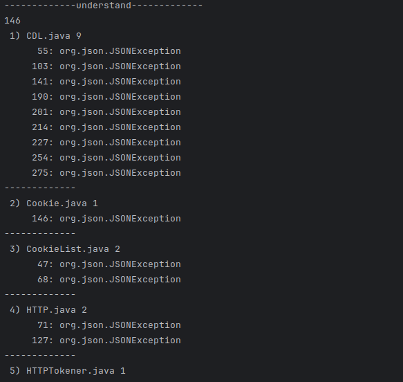
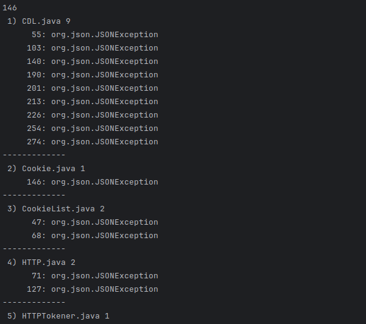
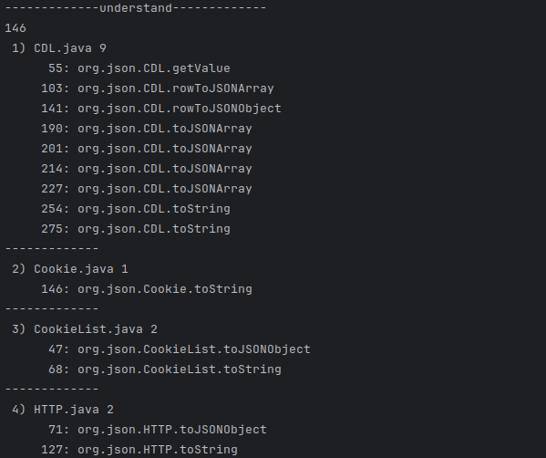
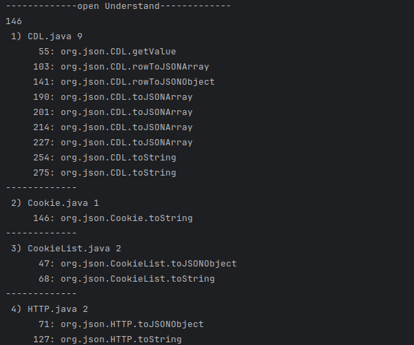

# Throw ThrowBy

## Understand VS OpenUnderstand (JSON project)

### at first step we show count of entity and after that we show this pattern :

file_number) file name count_of_entity

line_number: refrence_longname

------------------------------------------

- Throw output in Understand


- Throw output in OpenUnderstand


```
146
 1) CDL.java 9
	  55: org.json.JSONException
	 103: org.json.JSONException
	 141: org.json.JSONException
	 190: org.json.JSONException
	 201: org.json.JSONException
	 214: org.json.JSONException
	 227: org.json.JSONException
	 254: org.json.JSONException
	 275: org.json.JSONException
-------------
 2) Cookie.java 1
	 146: org.json.JSONException
-------------
 3) CookieList.java 2
	  47: org.json.JSONException
	  68: org.json.JSONException
-------------
 4) HTTP.java 2
	  71: org.json.JSONException
	 127: org.json.JSONException
-------------
 5) HTTPTokener.java 1
	  49: org.json.JSONException
-------------
 6) JSONArray.java 34
	1408: org.json.JSONException
	 108: org.json.JSONException
	 163: org.json.JSONException
	 224: org.json.JSONException
	 241: org.json.JSONException
	1655: org.json.JSONException
	 263: org.json.JSONException
	 401: org.json.JSONException
	 420: org.json.JSONException
	 282: org.json.JSONException
	 306: org.json.JSONException
	 376: org.json.JSONException
	 328: org.json.JSONException
	 438: org.json.JSONException
	 460: org.json.JSONException
	 478: org.json.JSONException
	 496: org.json.JSONException
	 350: org.json.JSONException
	 517: org.json.JSONException
	 547: org.json.JSONException
	 979: org.json.JSONException
	 992: org.json.JSONException
	1064: org.json.JSONException
	1080: org.json.JSONException
	1097: org.json.JSONException
	1114: org.json.JSONException
	1131: org.json.JSONException
	1148: org.json.JSONException
	1167: org.json.JSONException
	1188: org.json.JSONException
	1262: org.json.JSONException
	1467: org.json.JSONException
	1484: org.json.JSONException
	1517: org.json.JSONException
-------------
 7) JSONML.java 11
	  51: org.json.JSONException
	 246: org.json.JSONException
	 268: org.json.JSONException
	 290: org.json.JSONException
	 307: org.json.JSONException
	 325: org.json.JSONException
	 345: org.json.JSONException
	 363: org.json.JSONException
	 383: org.json.JSONException
	 394: org.json.JSONException
	 474: org.json.JSONException
-------------
 8) JSONObject.java 40
	2292: org.json.JSONException
	1824: org.json.JSONException
	 858: org.json.JSONException
	2164: NumberFormatException
	2382: org.json.JSONException
	2275: org.json.JSONException
	2458: java.io.IOException
	2501: java.io.IOException
	 484: org.json.JSONException
	 216: org.json.JSONException
	 405: org.json.JSONException
	 419: org.json.JSONException
	 516: org.json.JSONException
	 566: org.json.JSONException
	 658: org.json.JSONException
	 636: org.json.JSONException
	 612: org.json.JSONException
	 677: org.json.JSONException
	 591: org.json.JSONException
	 699: org.json.JSONException
	 743: org.json.JSONException
	 764: org.json.JSONException
	 781: org.json.JSONException
	 799: org.json.JSONException
	 721: org.json.JSONException
	 892: org.json.JSONException
	1016: org.json.JSONException
	1700: org.json.JSONException
	1718: org.json.JSONException
	1735: org.json.JSONException
	1752: org.json.JSONException
	1769: org.json.JSONException
	1786: org.json.JSONException
	1804: org.json.JSONException
	1850: org.json.JSONException
	1874: org.json.JSONException
	1977: java.io.IOException
	2351: org.json.JSONException
	2453: org.json.JSONException
	2535: org.json.JSONException
-------------
 9) JSONPointer.java 2
	 206: org.json.JSONPointerException
	 232: org.json.JSONPointerException
-------------
10) JSONTokener.java 11
	 192: org.json.JSONException
	 105: org.json.JSONException
	 374: org.json.JSONException
	 244: org.json.JSONException
	 163: org.json.JSONException
	 397: org.json.JSONException
	 290: org.json.JSONException
	 421: org.json.JSONException
	 266: org.json.JSONException
	 311: org.json.JSONException
	 472: org.json.JSONException
-------------
11) JSONWriter.java 14
	 324: org.json.JSONException
	 112: org.json.JSONException
	 146: org.json.JSONException
	 163: org.json.JSONException
	 188: org.json.JSONException
	 198: org.json.JSONException
	 210: org.json.JSONException
	 250: org.json.JSONException
	 270: org.json.JSONException
	 291: org.json.JSONException
	 379: org.json.JSONException
	 389: org.json.JSONException
	 399: org.json.JSONException
	 411: org.json.JSONException
-------------
12) Property.java 2
	  42: org.json.JSONException
	  62: org.json.JSONException
-------------
13) XML.java 11
	 231: org.json.JSONException
	 257: org.json.JSONException
	 491: NumberFormatException
	 577: org.json.JSONException
	 597: org.json.JSONException
	 622: org.json.JSONException
	 649: org.json.JSONException
	 683: org.json.JSONException
	 708: org.json.JSONException
	 720: org.json.JSONException
	 751: org.json.JSONException
-------------
14) XMLTokener.java 5
	 101: org.json.JSONException
	 268: org.json.JSONException
	  73: org.json.JSONException
	 200: org.json.JSONException
	 141: org.json.JSONException
-------------
```

- ImportBy output in Understand


- ImportBy output in OpenUnderstand


```
146
 1) CDL.java 9
	  55: org.json.CDL.getValue
	 103: org.json.CDL.rowToJSONArray
	 141: org.json.CDL.rowToJSONObject
	 190: org.json.CDL.toJSONArray
	 201: org.json.CDL.toJSONArray
	 214: org.json.CDL.toJSONArray
	 227: org.json.CDL.toJSONArray
	 254: org.json.CDL.toString
	 275: org.json.CDL.toString
-------------
 2) Cookie.java 1
	 146: org.json.Cookie.toString
-------------
 3) CookieList.java 2
	  47: org.json.CookieList.toJSONObject
	  68: org.json.CookieList.toString
-------------
 4) HTTP.java 2
	  71: org.json.HTTP.toJSONObject
	 127: org.json.HTTP.toString
-------------
 5) HTTPTokener.java 1
	  49: org.json.HTTPTokener.nextToken
-------------
 6) JSONArray.java 34
	 106: org.json.JSONArray.JSONArray
	 161: org.json.JSONArray.JSONArray
	 222: org.json.JSONArray.JSONArray
	 239: org.json.JSONArray.JSONArray
	1653: org.json.JSONArray.addAll
	 261: org.json.JSONArray.get
	 399: org.json.JSONArray.getBigDecimal
	 418: org.json.JSONArray.getBigInteger
	 280: org.json.JSONArray.getBoolean
	 304: org.json.JSONArray.getDouble
	 374: org.json.JSONArray.getEnum
	 326: org.json.JSONArray.getFloat
	 436: org.json.JSONArray.getInt
	 458: org.json.JSONArray.getJSONArray
	 476: org.json.JSONArray.getJSONObject
	 494: org.json.JSONArray.getLong
	 348: org.json.JSONArray.getNumber
	 515: org.json.JSONArray.getString
	 545: org.json.JSONArray.join
	 977: org.json.JSONArray.put
	 990: org.json.JSONArray.put
	1062: org.json.JSONArray.put
	1078: org.json.JSONArray.put
	1095: org.json.JSONArray.put
	1112: org.json.JSONArray.put
	1129: org.json.JSONArray.put
	1146: org.json.JSONArray.put
	1165: org.json.JSONArray.put
	1186: org.json.JSONArray.put
	1260: org.json.JSONArray.putAll
	1406: org.json.JSONArray.toJSONObject
	1465: org.json.JSONArray.toString
	1482: org.json.JSONArray.write
	1515: org.json.JSONArray.write
-------------
 7) JSONML.java 11
	  51: org.json.JSONML.parse
	 246: org.json.JSONML.toJSONArray
	 268: org.json.JSONML.toJSONArray
	 290: org.json.JSONML.toJSONArray
	 307: org.json.JSONML.toJSONArray
	 325: org.json.JSONML.toJSONObject
	 345: org.json.JSONML.toJSONObject
	 363: org.json.JSONML.toJSONObject
	 383: org.json.JSONML.toJSONObject
	 394: org.json.JSONML.toString
	 474: org.json.JSONML.toString
-------------
 8) JSONObject.java 40
	 216: org.json.JSONObject.JSONObject
	 405: org.json.JSONObject.JSONObject
	 419: org.json.JSONObject.JSONObject
	 484: org.json.JSONObject.accumulate
	 516: org.json.JSONObject.append
	 566: org.json.JSONObject.get
	 658: org.json.JSONObject.getBigDecimal
	 636: org.json.JSONObject.getBigInteger
	 612: org.json.JSONObject.getBoolean
	 677: org.json.JSONObject.getDouble
	 591: org.json.JSONObject.getEnum
	 699: org.json.JSONObject.getFloat
	 743: org.json.JSONObject.getInt
	 764: org.json.JSONObject.getJSONArray
	 781: org.json.JSONObject.getJSONObject
	 799: org.json.JSONObject.getLong
	 721: org.json.JSONObject.getNumber
	 858: org.json.JSONObject.getString
	 892: org.json.JSONObject.increment
	1016: org.json.JSONObject.numberToString
	1700: org.json.JSONObject.put
	1718: org.json.JSONObject.put
	1735: org.json.JSONObject.put
	1752: org.json.JSONObject.put
	1769: org.json.JSONObject.put
	1786: org.json.JSONObject.put
	1804: org.json.JSONObject.put
	1824: org.json.JSONObject.put
	1850: org.json.JSONObject.putOnce
	1874: org.json.JSONObject.putOpt
	2275: org.json.JSONObject.testValidity
	2292: org.json.JSONObject.toJSONArray
	2351: org.json.JSONObject.toString
	2382: org.json.JSONObject.valueToString
	2453: org.json.JSONObject.write
	2535: org.json.JSONObject.write
	2458: org.json.JSONObject.writeValue
	2501: org.json.JSONObject.indent
	1977: org.json.JSONObject.quote
	2164: org.json.JSONObject.stringToNumber
-------------
 9) JSONPointer.java 2
	 206: org.json.JSONPointer.queryFrom
	 232: org.json.JSONPointer.readByIndexToken
-------------
10) JSONTokener.java 11
	 105: org.json.JSONTokener.back
	 163: org.json.JSONTokener.more
	 192: org.json.JSONTokener.next
	 244: org.json.JSONTokener.next
	 266: org.json.JSONTokener.next
	 290: org.json.JSONTokener.nextClean
	 311: org.json.JSONTokener.nextString
	 374: org.json.JSONTokener.nextTo
	 397: org.json.JSONTokener.nextTo
	 421: org.json.JSONTokener.nextValue
	 472: org.json.JSONTokener.skipTo
-------------
11) JSONWriter.java 14
	 112: org.json.JSONWriter.append
	 146: org.json.JSONWriter.array
	 163: org.json.JSONWriter.end
	 188: org.json.JSONWriter.endArray
	 198: org.json.JSONWriter.endObject
	 210: org.json.JSONWriter.key
	 250: org.json.JSONWriter.object
	 270: org.json.JSONWriter.pop
	 291: org.json.JSONWriter.push
	 379: org.json.JSONWriter.value
	 389: org.json.JSONWriter.value
	 399: org.json.JSONWriter.value
	 411: org.json.JSONWriter.value
	 324: org.json.JSONWriter.valueToString
-------------
12) Property.java 2
	  42: org.json.Property.toJSONObject
	  62: org.json.Property.toProperties
-------------
13) XML.java 11
	 231: org.json.XML.noSpace
	 257: org.json.XML.parse
	 577: org.json.XML.toJSONObject
	 597: org.json.XML.toJSONObject
	 622: org.json.XML.toJSONObject
	 649: org.json.XML.toJSONObject
	 683: org.json.XML.toJSONObject
	 708: org.json.XML.toJSONObject
	 720: org.json.XML.toString
	 751: org.json.XML.toString
	 491: org.json.XML.stringToNumber
-------------
14) XMLTokener.java 5
	  73: org.json.XMLTokener.nextCDATA
	 101: org.json.XMLTokener.nextContent
	 141: org.json.XMLTokener.nextEntity
	 200: org.json.XMLTokener.nextMeta
	 268: org.json.XMLTokener.nextToken
-------------
```

### for test on openunderstand [see here](./open_understand/throw_throwby_test.py)

### for test on understand [see here](./understand/throw_throwby_test.py)

-in some part openunderstand is better than understand. in showing scope and parent out put of openunderstand is very cleaner than understand.

### writer Alireza Mahdizade.